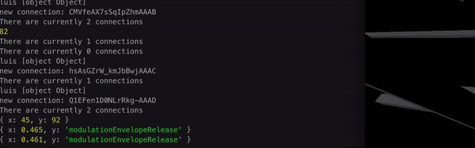
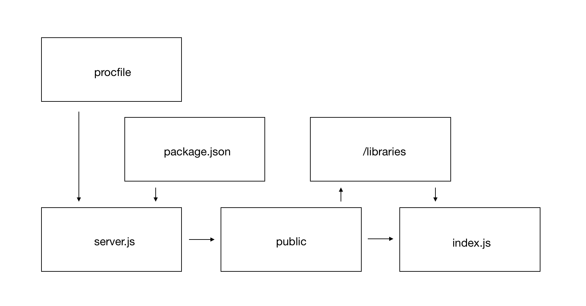

Build
============
The Akson underlying code is currently hosted on GitHub on a public repository. This way everyone can clone, fork and work with the Akson code.
The next instructions will allow any user to get working with Akson in a clean and simple way. All the dependencies and libraries
that are needed to get the system on the user computer running will be detailed on the major platforms. When the server is running, the user has some
command line display of what is going on.

MacOS
-------------------------------

* Open the terminal

* To be able to fully experience and later edit the Akson code, the user must have some libraries the engine relies on. Node.js is one of them. One easy way to install node is using the package manager Homebrew and for that the user needs the XCode installed. To install Homebrew the user can type the following.

.. code::

      $ /usr/bin/ruby -e "$(curl -fsSL https://raw.githubusercontent.com/Homebrew/install/master/install)"
      $ brew install node
      $ git --version
      $ cd Desktop
      $ git clone https://github.com/luisArandas/akson
      $ cd akson
      $ npm install
      $ node server.js

* Akson targets Chromium based devices and it is possible to access by typing in the browser: localhost:5000

Windows
-------------------------------

Akson was developed on MacOS machines originally but thanks to the cross-platform technologies it is possible to use in the most used operating systems.
On windows to install Node and Git the user can download the installer directly from the website. https://nodejs.org/en/download/ and https://git-scm.com/download/win
After that the user can open command-prompt selecting the Start button and typing the following.

.. code::

    $ cmd
    $ cd C:\Users\username\Desktop
    $ git clone https://github.com/luisArandas/akson
    $ cd akson
    $ npm install
    $ node server.js

Linux
-------------------------------

On linux the terminal work is quite similar to MacOS and as a UNIX system there are multiple similarities on the way the system behaves.
If you’re on Fedora (or any closely-related RPM-based distribution, such as RHEL or CentOS), you can use dnf. If you’re on a Debian-based distribution,
such as Ubuntu, try apt:

.. code::

    $ sudo dnf install git-all
    $ sudo apt install git-all
    $ sudo apt update
    $ sudo apt install nodejs npm
    $ sudo apt install npm
    $ node server.js

File Architecture
-------------------------------

The correct way to run the system through the source code is through the file ``server.js``.
The repository has a ``procfile`` to tell the Unix server (currently Heroku) to run it. This file is the starting point of Akson, and when the server is up,
with all dependencies respected (to update it is enough to use ``npm install``) such as ``express`` and ``socket.io``, the ``public``
folder can then start to run. In this folder is where the front-end is structures (both the graphics and audio) so every connected device can have
their own instance.
