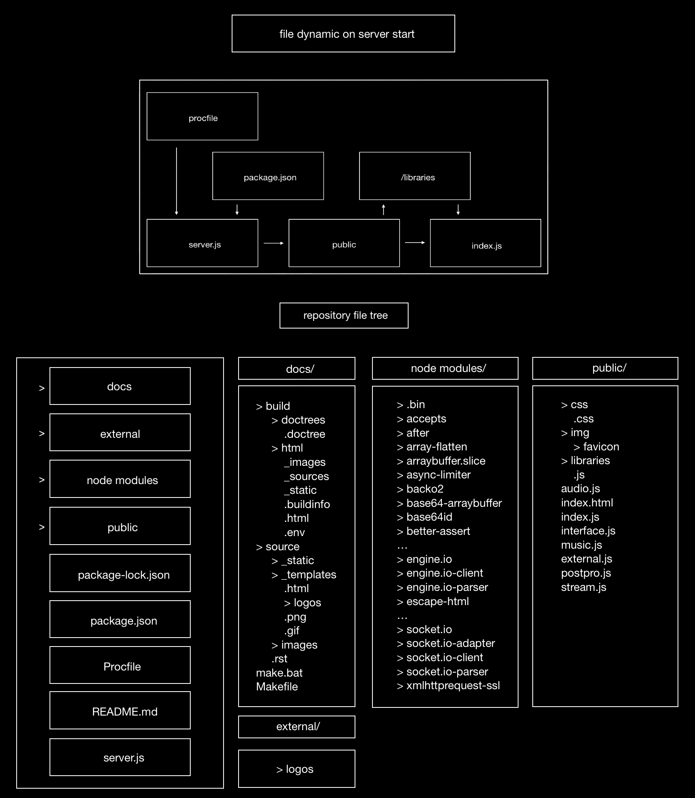

Engine
============

File Architecture
-------------------------------

The correct way to run the system through the source code is through the file ``server.js``.
The repository has a ``procfile`` to tell the Unix server (currently Heroku) to run it. This file is the starting point of Akson, and when the server is up,
with all dependencies respected (to update it is enough to use ``npm install``) such as ``express`` and ``socket.io``, the ``public``
folder can then start to run. In this folder is where the front-end is structures (both the graphics and audio) so every connected device can have
their own instance.
