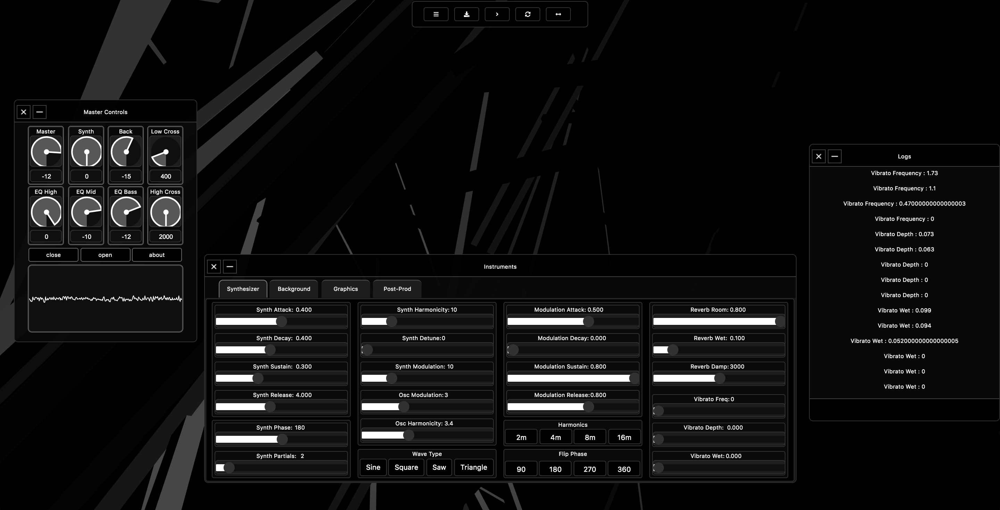

[Akson] Software Documentation
====================================

This is the official website for the documentation of Akson, a networked audiovisual environment that allows multi-user collaboration.
Here you will find a detailed explanation of the software, the way it is done and how its features work. With examples documented from images and code, an
extensive documentation is structured.

.. toctree::

   build.rst
   interface.rst
   audio.rst
   graphics.rst
   networks.rst

Useful Links
------------

* `Akson Environment <https://akson.xyz>`_
* `Akson Code <https://www.github.com/luisArandas/akson>`_
* `Author Website <https://www.luisarandas.org>`_

© Copyright 2019, Luis Arandas.
