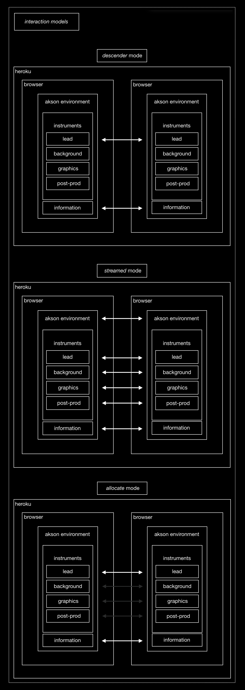

Interaction
============

Models
-------------------------------
Interaction models are undoubtedly one the most important things of this investigation and of Akson. Since one of the main focuses in this whole process is in collaborative interfaces, modes of interaction are undoubtedly the fundamental point for collaboration. 

