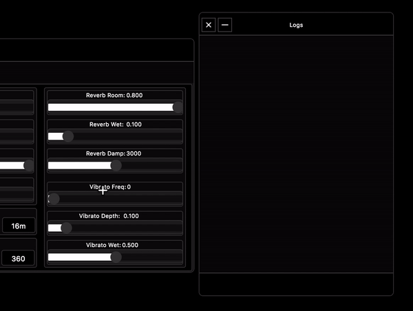

Interface
=====================

To experience Akson, the user does not need to deal with code or understand how the technologies described above work in the first place.
One can access the current host by typing in a browser ``www.akson.xyz``. This project mainly targets Chromium-based browsers. Chromium is an open-source web
browser project in which Google Chrome bases its source code. Akson is an audio-visual instrument that allows interaction on the browser screen directly with the
graphics generated, but also has a more conventional graphical user interface (GUI) composed of dials, sliders and buttons.
When the main website loads (and/or the local code build), the scene starts with all it's attributes but with no GUI. Only a custom pop-up box appears on the
bottom of the screen so the user knows that he can trigger it by pressing the space key.

To have complete control of the instrument, there is the possibility to open a graphical interface that has a series of controls.
These enable an advanced level of usage on Akson.

.. image:: images/interface1.gif

There are three dialogs that appear when the user opens the interface for the first time. The master controller. The main instrument controller,
and a panel that prints all the names of the methods modified by the graphical interface. In conjunction with the dialogs there is also a bar at the top
of the window with buttons.

.. image:: images/dialogs.png

Master Controller
-------------------------------

The master controller has effect on the main out of the browser sound system. Connected to the AudioDestinationNode, it provides useful conveniences
such as the ability to set the volume and mute the entire application. There is also the possibility to click on the 'about' button. This brings up
a window with information about the system where Akson is running, and explains the various models of interaction in the network.

The master dialog consists of 8 dials, 3 buttons and an oscilloscope. The dials have linked to each other number boxes and also print in the logs panel.
The dial with the Master name controls the volume of the complete instrument, the Synth controls the volume of the lead Synthesizer and the Back controls the
noise background. The remaining 5 dials are equalizers in the master, one for High, Low, Mid and two crossovers a High and a Low.

Instrument Controller
-------------------------------

The instrument controller is the most extensive panel in the graphical interface and it has many of the methods and attributes that the user can change
in the instrument. it is divided into four parts, one for each bit of Akson. Synthesizer, Background, Graphics and Post-Prod. These allow different
interactions in the system.

The Synthesizer interface has 21 independent sliders and 12 buttons that control both the Synth and the built-in processing effects such as Reverb and Vibrato.
The Background interface has 17 independent sliders and 26 buttons to control both the Noise generator and an AutoFilter. The Graphics interface has 20 sliders
that control both the Camera, Lights and some Geometry properties. The Post-Prod interface has 6 sliders to change camera Offset, 5 Preset buttons, 5 buttons of
Shaders, 3 panels for WebGL performance view and the main interface to change notes to the Synthesizer to play.

Logs Dialog
-------------------------------

The Logs dialog shows when something in the graphical user interface has been changed. It also works on streaming mode so the users can see which one is doing what.

Top Button Bar
-------------------------------

The Top Button Bar has this that and that

The button bar has 5 fundamental buttons. From left to right we have first the *About* button. Triggers a modal window with a text about Akson. On second place
we have the download button, to record audio with the Media capture API and photos of the WebGL camera. In the middle we a button that continuously changes scene.
On the 4 place we have the refresh button, if one is running Akson on app and/or can't acess the browsing bar. And at last we have the Interaction model interface.
Triggering this will call another modal window that let's the user choose what type of interaction he is in.

FOTOS DOS MENUS AQUI

Keyboard
-------------------------------

Some of the most important functions of Akson can also be acessed by keyboard. A map has been done so that the user can consult the keycodes, functions and methods
of action.

TABELA
